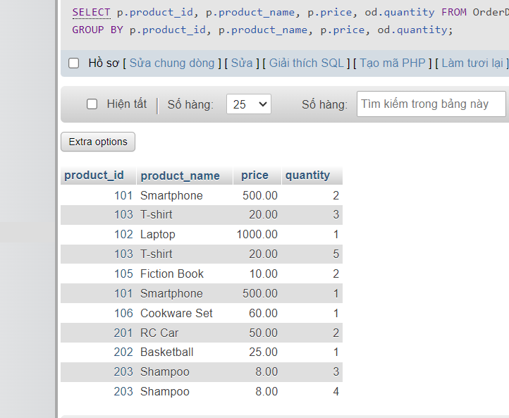
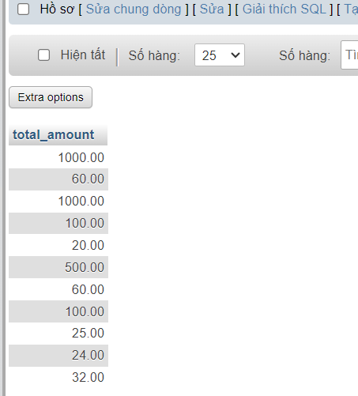
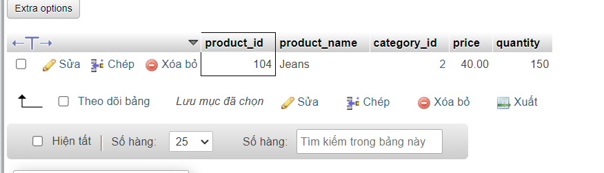
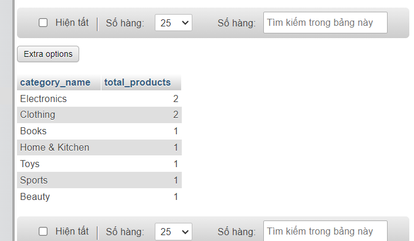
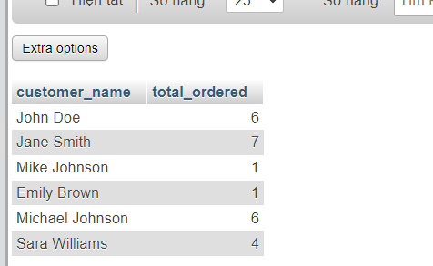
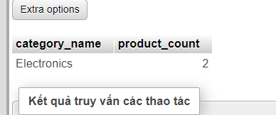
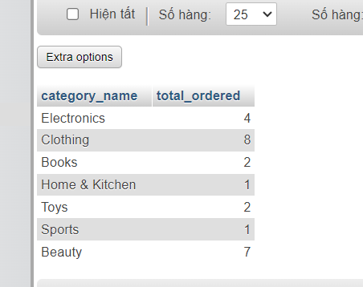
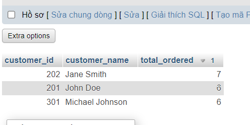
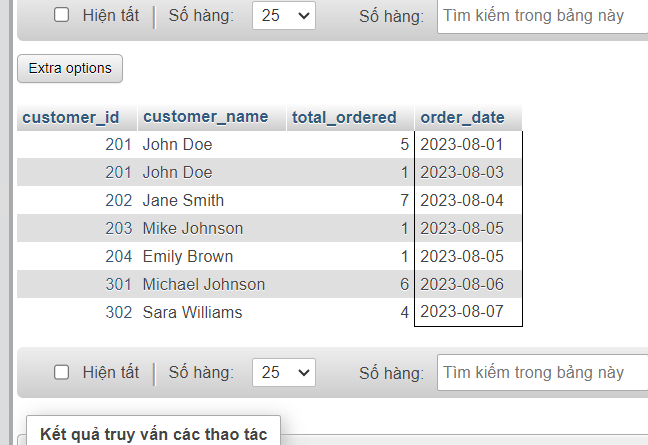
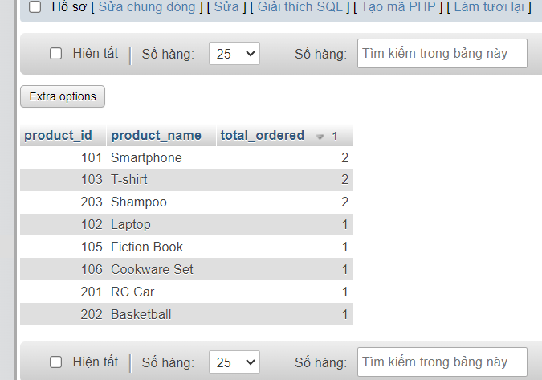

### BÀI KIỂM TRA

```sql
Câu 1:
SELECT p.product_id, p.product_name, p.price, od.quantity
FROM OrderDetails od
JOIN Products p ON od.product_id = p.product_id
GROUP BY p.product_id, p.product_name, p.price, od.quantity;
```



```sql
Câu 2:
SELECT SUM(p.price * od.quantity) AS total_amount
FROM OrderDetails od
JOIN Products p ON od.product_id = p.product_id
GROUP BY p.price, od.quantity;
```



```sql
Câu 3:
SELECT *
FROM Products
WHERE product_id NOT IN (
    SELECT DISTINCT product_id
    FROM OrderDetails
);
```



```sql
Câu 4:
SELECT c.category_name, COUNT(p.product_id) AS total_products
FROM Categories c
JOIN Products p ON c.category_id = p.category_id
GROUP BY c.category_name;
```



```sql
Câu 5:
SELECT c.customer_name, SUM(od.quantity) AS total_ordered
FROM Customers c
JOIN Orders o ON c.customer_id = o.customer_id
JOIN OrderDetails od ON o.order_id = od.order_id
GROUP BY c.customer_name;
```



```sql
Câu 6:
SELECT c.category_name, COUNT(p.product_id) AS product_count
FROM Categories c
JOIN Products p ON c.category_id = p.category_id
GROUP BY c.category_name
ORDER BY product_count DESC
LIMIT 1;
```



```sql
Câu 7:
SELECT c.category_name, SUM(od.quantity) AS total_ordered
FROM Categories c
JOIN Products p ON c.category_id = p.category_id
JOIN OrderDetails od ON p.product_id = od.product_id
GROUP BY c.category_name;
```



```sql
Câu 8:
SELECT c.customer_id, c.customer_name, SUM(od.quantity) AS total_ordered
FROM Customers c
JOIN Orders o ON c.customer_id = o.customer_id
JOIN OrderDetails od ON o.order_id = od.order_id
GROUP BY c.customer_id, c.customer_name
ORDER BY total_ordered DESC
LIMIT 3;
```



```sql
Câu 9:
SELECT c.customer_id, c.customer_name, SUM(od.quantity) AS total_ordered, o.order_date
FROM Customers c
JOIN Orders o ON c.customer_id = o.customer_id
JOIN OrderDetails od ON o.order_id = od.order_id
WHERE o.order_date BETWEEN '2023-08-01' AND '2023-08-07'
GROUP BY c.customer_id, c.customer_name, o.order_date;
```



```sql
Câu 10:
SELECT p.product_id, p.product_name, COUNT(ord.order_id) AS total_ordered
FROM Products p
JOIN OrderDetails ord ON p.product_id = ord.product_id
GROUP BY p.product_id, p.product_name
ORDER BY total_ordered DESC;
```


